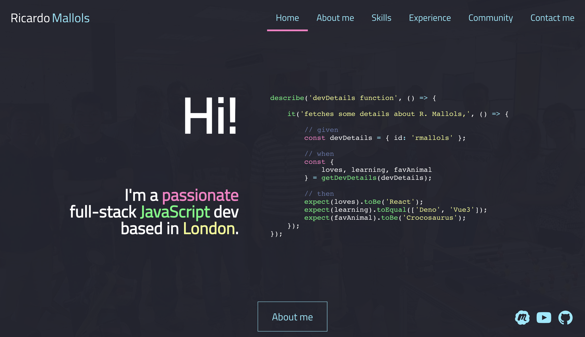
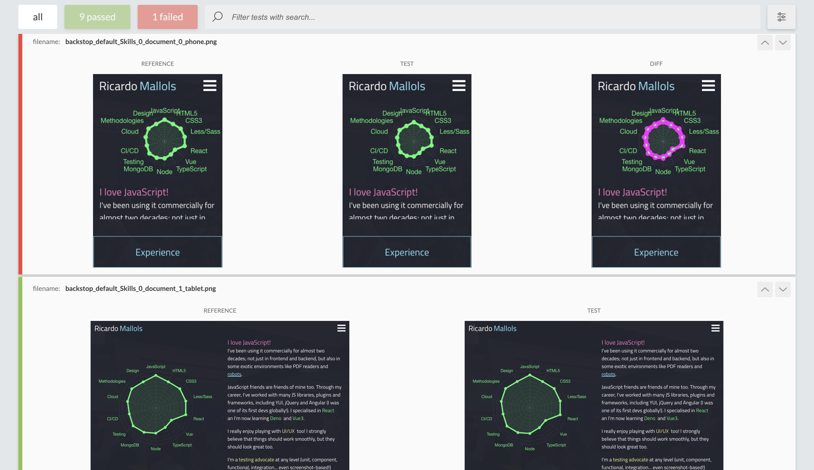
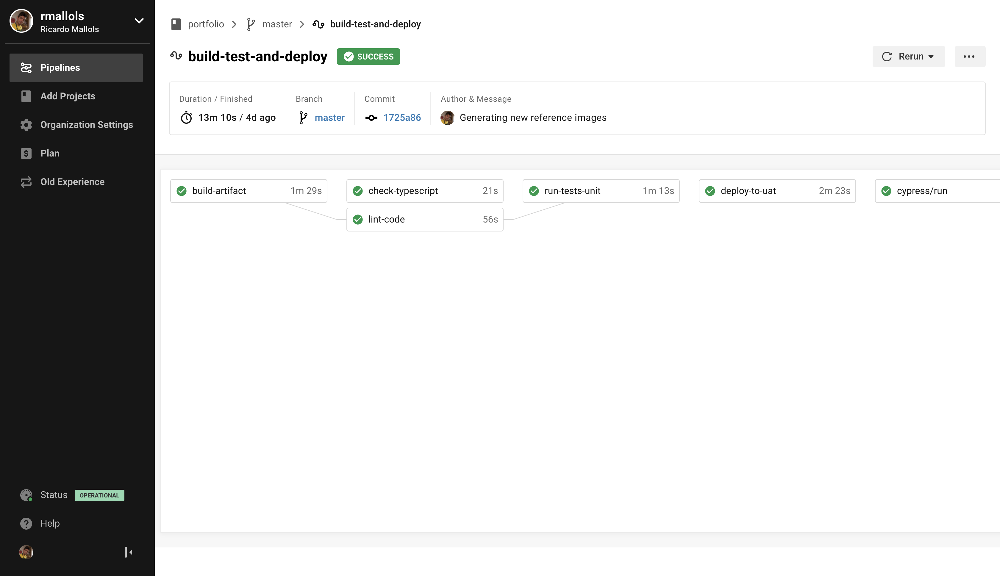

# Ricardo Mallols portfolio

Hi! I recently decided to upgrade my portfolio, and so I wanted to share it with the community
in case anybody is interested on using it as a template.

**Live version**: [https://mallols.dev](https://mallols.dev)

## Stack

I've followed a mobile-first approach, based on a modern stack that incorporates some of the most popular technologies these days.
The project runs on top of [Create React App](https://github.com/facebook/create-react-app),
the official app bootstrapping tool offered by Facebook. 

* HTML
* CSS
* Sass
* JavaScript
* ReactJs
* TypeScript

The setup is quite standard. Simply checkout the repo, install the dependencies with `npm install` and start the server with `npm start`.

## Testing

Even though the test coverage isn't any impressive at all, at least the project incorporates most of layers testing of the testing pyramid, for reference purposes:

* Linting with [ESLint](https://eslint.org/) (`npm run lint`).
* Unit & component testsing with [Jest](https://jestjs.io/) and [React Testing Library](https://testing-library.com/) (`npm run test:unit`).
* End to End testing with [Cypress](https://www.cypress.io/) (`npm run test:e2e:local`).
* Visual Regression Testing with [BackStopJS](https://github.com/garris/BackstopJS) (`npm run test:visual:test`).

## CI

The project integrates with [CircleCI](https://circleci.com/) to ensuring the tests run smoothly before deploying the changes to [Vercel](https://vercel.com/).

The workflow runs as follow:

1. Run linting, Testing and TypeScript checks first, trying to parallelise some of the steps for performance reasons.
2. If everything is OK, then deploy the changes to a UAT environment ([https://portfolio.rmallols.now.sh/](https://portfolio.rmallols.now.sh/)).
3. If the changes apply to the master branch, request manual acceptance.
4. Once the changes are approved, the version is dumped and they are deployed to the PRD environment ([https://mallols.dev](https://mallols.dev)).

## Known issues

1. [ESLint doesn't run in watch mode locally](https://github.com/facebook/create-react-app/issues/8683).
2. Visual Regression Testing runs fine locally, but it doesn't on CircleCI. That's because the [official Orb](https://circleci.com/orbs/registry/orb/reload/backstop) runs btoh the "Generate" and "Test" tasks sequentially - but we'd only want to run the latter!

## Questions

Feel free to drop me a message at [hi@mallols.dev](mailto:hi@mallols.dev)

## License

This project is [MIT licensed](./LICENSE).